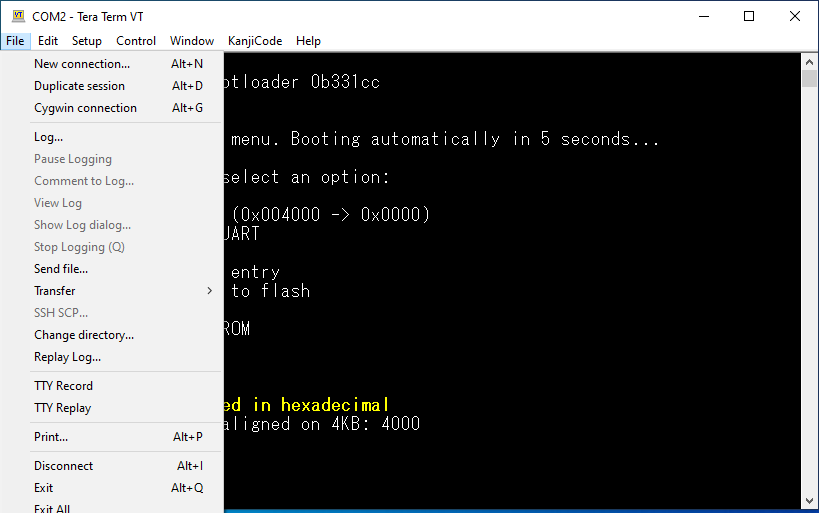

<p align="center">
    
</p>
<p align="center">
    <a href="https://opensource.org/licenses/Apache-2.0">
        
    </a>
    <p align="center">A simple bootloader entirely written in Z80 assembly, for Zeal 8-bit Computer, a homebrew 8-bit computer based on a Z80 CPU.</p>
</p>

## About this project

The goal of this project is to provide a small bootloader for Zeal 8-bit Computer that lets us perform several operations directly from the computer itself, such as booting different operating systems, flashing the ROM, testing the hardware, without the need of any external devices.

## Features

<p align="center">
    
</p>

As you can see from the menu itself, several feature have been implemented:

* Communication over UART (no need for the video board)
* 5 seconds auto-boot on startup
* Up to 9 operating systems or programs can be set up to boot from the menu. In the example above, only one entry is present: Zeal 8-bit OS. The numbers between the parenthesis represent the physical address (in ROM) and the virtual address respectively. In the output above, Zeal 8-bit OS is flashed at address **0x4000** in the ROM, it will be mapped at virtual address **0x0000** when booted.
* Program can be sent through UART, and booted **directly**. No need to flash the ROM. This is handy for development when testing a program.
* New entries can be added as bootable systems, directly from the bootloader itself.
* Symmetrically, entries can be deleted directly from the bootloader. Note that it is not possible to delete all entries, there must at least be one remaining entry at all time.
* Buffered changes. To prevent mistakes when adding and deleting entries, the changes are first saved to RAM. The changes can then be flushed (**s** option) or discard (reboot the system).
* Baudrate can be changed for the current bootloader session. Handy if there are corrupted data when transferring programs over UART.
* Test Zeal 8-bit Computer hardware. This includes tests for the RAM size, the ROM size, the I2C EEPROM, the I2C RTC, and the PS/2 keyboard.

## Building the project

### Requirements

At the moment, the project has only been assembled on Linux (Ubuntu 20.04 and 22.04), it should be compatible with Mac OS and Windows as long as you have:

* bash
* git (to clone this repo)
* make
* z88dk v2.2 (or later). Only its assembler, `z80asm`, is strictly required. The latest version of `z80asm` must be used as earlier versions don't have support for `MACRO`.

To install z88dk, please [check out their Github project](https://github.com/z88dk/z88dk).

### Building

To build the bootloader, simply use the command:
```
make
```

After compiling, the folder `build/` should contain the binary `bootloader.bin` and `bootloader.dump`. The first one is the program itself, whereas the second is a text file containing the disassembled binary with debug symbols.

That dump is only useful when debugging the bootloader (mainly with [Zeal 8-bit Computer emulator](https://github.com/Zeal8bit/Zeal-WebEmulator)).

## Transferring data over UART

As you saw in the features list, it is possible to send programs through UART, either to load and execute it or to flash it to the ROM. On the host computer, depending on whether you are using Linux, Mac OS or Windows, the procedure is different.

Let's say we want to flash a newer version of Zeal 8-bit OS, `os.bin` file, at physical address **0x4000** in ROM and with a size of **0x51d8** bytes (20952 bytes in decimal).

In the bootloader, after pressing the key for "Flash/Program the ROM" (**f** key), we see:

```
Numbers must be provided in hexadecimal
ROM address to flash, aligned on 4KB:
```

We specify **4000**, no need to type the **0x** prefix here, and press enter:

```
Numbers must be provided in hexadecimal
ROM address to flash, aligned on 4KB: 4000
Binary size:
```

The binary size is prompted, we type **51d8**, same, no need for the prefix:

```
Numbers must be provided in hexadecimal
ROM address to flash, aligned on 4KB: 4000
Binary size: 51d8
Please send file...
```

Here, we have to send the file as a <u>**raw binary**</u>. Let's see how to do this on Linux and Windows.

### Linux

**Note:** Here, I assume that the node used to communicate with Zeal 8-bit Computer through UART is `/dev/ttyUSB0`. If yours is different, replace it in the commands below (should be `/dev/ttyUSBx` or `/dev/ttyACMx` depending on your USB-to-TTL adapter).

On Linux, open a new terminal, configure the TTY as raw:

```
stty -F /dev/ttyUSB0 raw
```

And set the correct baudrate, which is 57600 by default:

```
stty -F /dev/ttyUSB0 57600
```

After this, it is possible to send the file thanks to **cat**:

```
cat os.bin > /dev/ttyUSB0
```

On the host, wait until the prompt is back. Once the transfer is finished, the bootloader (monitor) will show the message:

```
Flashing in progress, do not turn off...
```

Wait until it finishes and that's it!

### Windows

On Windows, only Tera Term can send raw binaries (or at least, it's the only one I have found that can do it). To do so, click on "File" and "Send file":



Locate your file **and make sure to tick binary box!**


Click on "Open", a popup should now show up, wait until the file finishes transferring.

Once the transfer is finished, the popup window should close itself, and the bootloader will show the message:

```
Flashing in progress, do not turn off...
```

Wait until it finishes and that's it!


## Why this project?

This project was born when it was decided to use start selling few samples of Zeal 8-bit Computer to developers. As the main operating system of the computer, [Zeal 8-bit OS](https://github.com/Zeal8bit/Zeal-8-bit-OS), is still under development. Thus, I wanted to provide a way for developers and users to boot several systems or software without the need to re-flash the ROM every time.

The logical feature to implement with such multi-boot capability is flash directly from the board, without the need of an external flasher, and so, without taking out the ROM chip.

One requirement I really wanted to see and implement is the possibility to flash a newer version of the bootloader, directly from the bootloader.


## Contact

For any suggestion or request, you can contact me at contact [at] zeal8bit [dot] com

Or, you can join Zeal 8-bit projects [Discord server](https://discord.gg/UzEjwRvBBb).

For features requests, you can also open an issue or a pull request.

## Contributing

Contributions are welcome! Feel free to fix any bug that you may see or encounter, or implement any feature that you find important.

To contribute:
  * Fork the Project
  * Create your feature Branch (*optional*)
  * Commit your changes. Please make a clear and concise commit message (*)
  * Push to the branch
  * Open a Pull Request


(*) A good commit message is as follow:
```
Module: add/fix/remove a from b

Explanation on what/how/why
```
For example:
```
Flash: add the possibility to flash programs bigger than 48KB
```

## License

Distributed under the Apache 2.0 License. See `LICENSE` file for more information.

You are free to use it for personal and commercial use, the boilerplate present in each file must not be removed.
